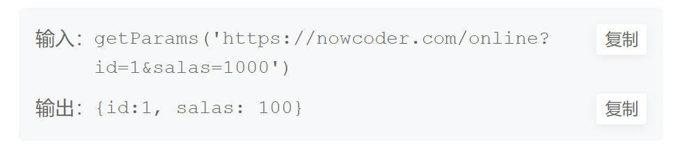

第一步.要把参数从url中拆解出来

~~~js
let arr = url.match(/(\w+)=(\w+)/gi);
或者url.split("?")[1].split("&")
~~~

第二步.构造一个空对象去承接

~~~js
let obj = {};
~~~

第三步.遍历

~~~js
arr.map(item => {
    let [key, value] = item.split("=");
    obj[key] = value;
})
~~~

