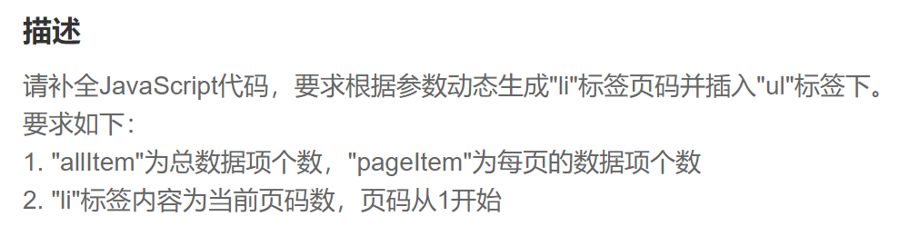

第一步.获取”ul“标签

~~~js
let ul = document.querySelector('#ul')
~~~

第二步.计算出总页数，需要向上取整

~~~js
let pageNumber = Math.ceil(allItem / pageItem)
~~~

第三步.进入循环，创建”li“节点且”li“.innerText为该循环当前轮次

~~~js
  for(let i=1 ; i<=pageNumber ; i++) {
        let li = document.createElement('li')
        li.innerText = i}
~~~

第四步.在循环内将”li“节点插入”ul“

~~~js
 ul.appendChild(li)
~~~

