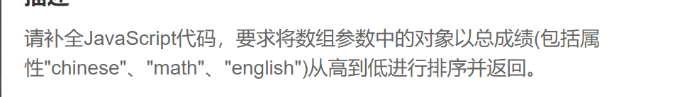

由题目可知为降序排序，所以用b-a

所以直接用sort方法就可以

~~~js
const _rank = array => {
    array.sort((a, b) => {
        let ag = a.chinese + a.math + a.english
        let bg = b.chinese + b.math + b.english
        return bg - ag
    })
    return array
~~~

最后返回新的数组

