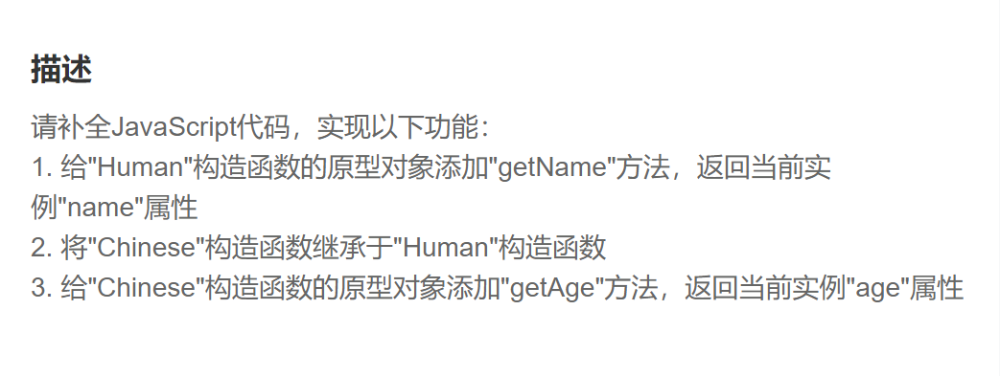

​		第一步.通过Human.prototype.getName给“Human”的原型添加“getName”函数

~~~JS
Human.prototype.getName = function() {
    return this.name
}
~~~

第二步.通过Chinese.prototype将“Chinese”的原型挂载在“Human”构造函数的实例上

~~~js
Chinese.prototype = new Human()
~~~

第三步.修复“Chinese”的原型链'

~~~JS
Chinese.prototype.constructor = Chinese
~~~

第四步.通过Chinese.prototype.getAge给“Chinese”的原型添加“getAge“函数

~~~js
Chinese.prototype.getAge = function() {
    return this.age
}
~~~

