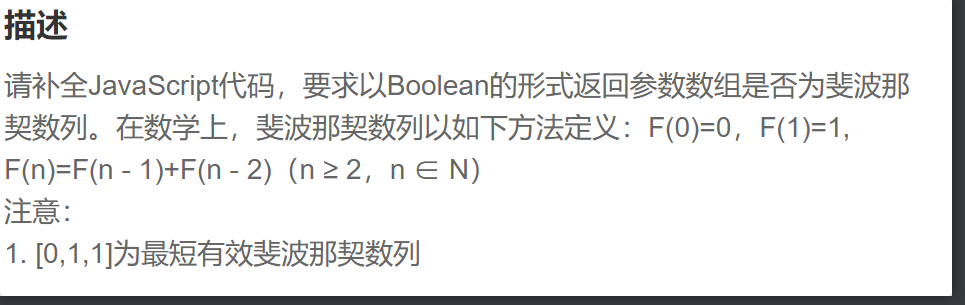

题目：

第一步：判断数组参数的长度是否小于3，第一、二项的值是否分别为0、1，如果其中一项不符合，那么返回false

~~~js
 if(array.length < 3 || array[0] !== 0 || array[1] !== 1) return false
~~~

第二步：遍历数组参数，从第三项开始，判断该项的值是否符合*F*(n)=*F*(n - 1)+*F*(n - 2)，是则continue，否则返回false

~~~js
  for(let i=2 ; i<array.length ; i++) {
        if(array[i] === array[i-1] + array[i-2]) continue
        return false
    }
~~~

第三步：判断完所有之后，如果成立返回true

~~~js
  return true
~~~

