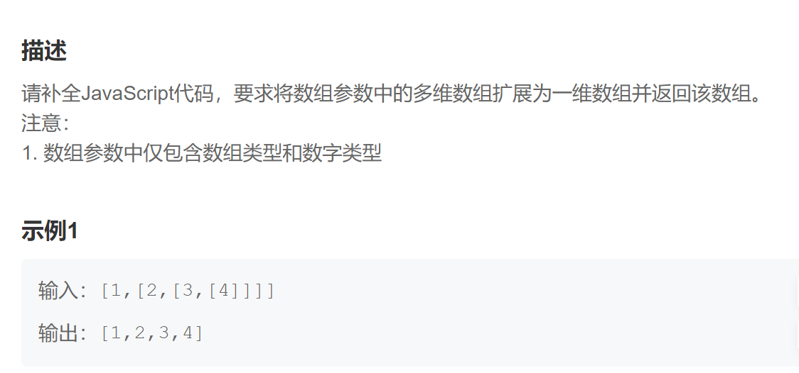
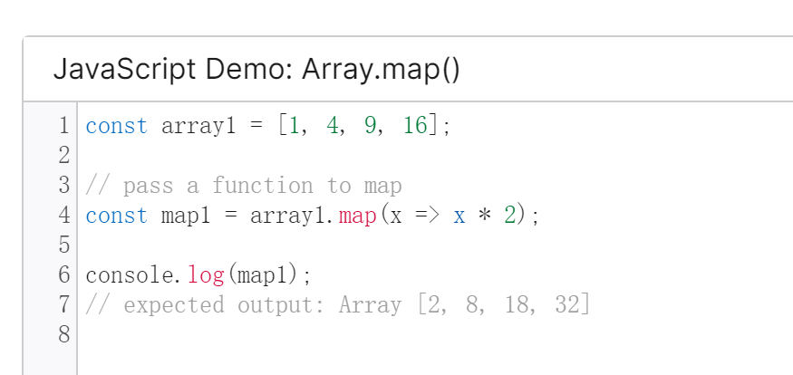
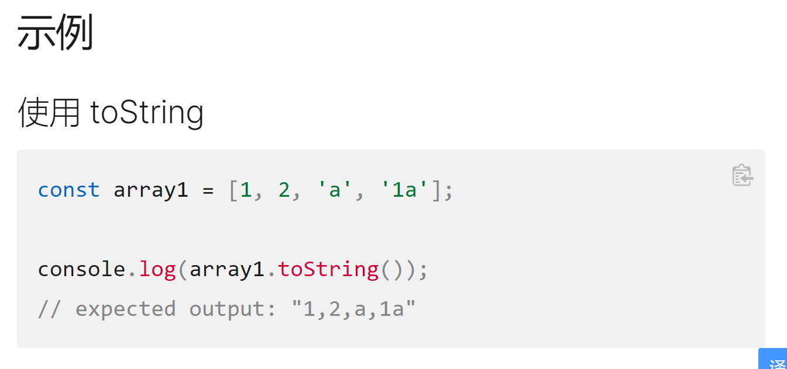

题目：

~~~js
map() 方法创建一个新数组，这个新数组由原数组中的每个元素都调用一次提供的函数后的返回值组成。
toString() 方法返回一个字符串，表示指定的数组及其元素。
~~~

split用法

**split()** 方法使用指定的分隔符字符串将一个[`String`](https://developer.mozilla.org/zh-CN/docs/Web/JavaScript/Reference/Global_Objects/String)对象分割成子字符串数组，以一个指定的分割字串来决定每个拆分的位置。

第一步 把多维数组变成一维数组

~~~js
  let arrNew = arr.toString().split(',') //['1', '2', '3', '4']
~~~

第二步  把数组中字符变成数字，生成一个新数组

~~~js
let arrNew2=arrNew.map((num) => {
                    return  Number(num)
                })
~~~

最后 返回这个新数组

~~~js
  return arrNew2
~~~

