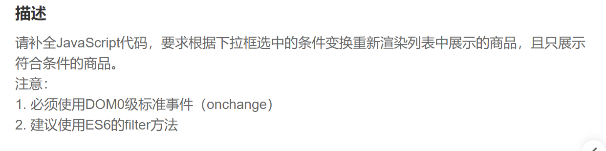
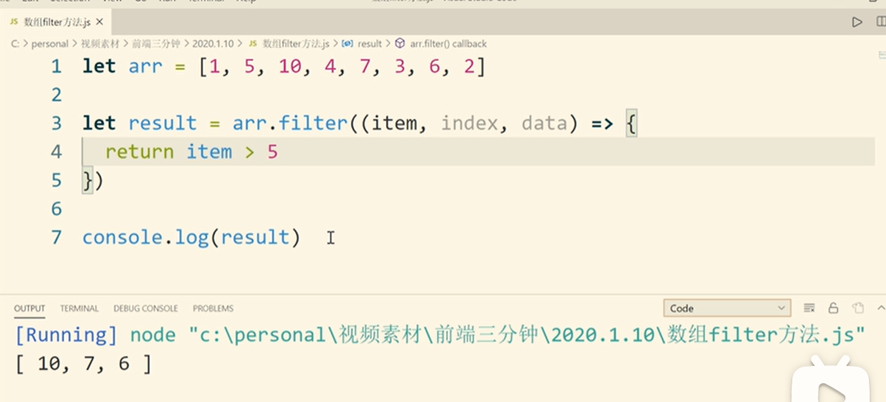

filter根据条件过滤，应为无法改变原数组，所以要定义一个新的数组来接收它

第一步.定义重渲染函数,，每"select"节点的onchange事件触发时，会调用该函数重新渲染ul列表中的内容

~~~js
function listRendering(arr) {
    var str = ''
    arr.forEach(element => {
        str += `<li>${element.name}</li>`
    })
 
    ul.innerHTML = str
}
~~~

第二步.给"select"节点添加onchange事件，每当事件触发，对"select"节点当前值进行判断，对"cups"数组进行重新排序并且调用重渲染函数

~~~js
select.onchange = function(){
    ul.innerHTML = ''
    switch(parseInt(this.value)){
        case 1 :
            var newArr = cups.filter((item)=>{return item.sales < 100})
            break
        case 2:
            var newArr = cups.filter((item)=>{return item.sales <= 500 && item.sales >= 100})
            break
        case 3:
            var newArr = cups.filter((item)=>{return item.sales > 500})
            break
    }
    listRendering(newArr)
}
 
~~~

