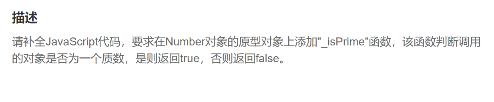

判断质数：一个大于1的自然数，除了1和它本身外，不能被其他自然数整除

根据判断条件写代码

第一步，去除1和0，应为质数大于0

~~~js
  if(number==1 || number==0) return false
~~~

第二步，遍历大于1的每个数并且小于他本身的

如果能整除，证明不是质数

~~~js
   for(let i=2; i<number; i++){
                if(number%i==0) return false
            }
~~~

最后，如果都不成立，证明是质数，返回true

~~~js
 return true
~~~

