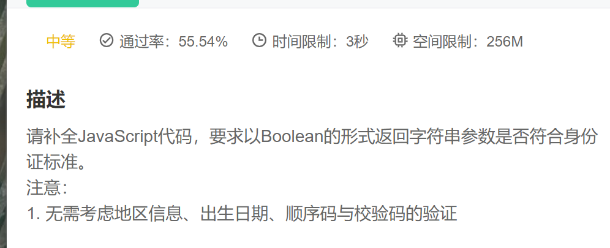

思路：

1. 创建正则表达式，一代身份证15位，二代身份证18位

2. 在二代身份证18位数字中，最后一位有可能是”x“|”X“

   ~~~js
    var regx = /(^\d{15}$)|(^\d{18}$)|(^\d{17}(\d|X|x)$)/
   ~~~

   最后一步：测试  如果正确返回true  

   ~~~js
   return regx.test(number)
   ~~~

   ​