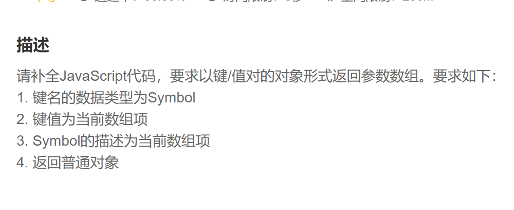

第一步：生成空对象

~~~js
 let object = {}
~~~

第二步：遍历数组

~~~js
  for(item of array) { }
~~~

第三步.生成Symbol实例，初始化时将数组的该项带入

~~~js
 let key = Symbol(item)
~~~

第四步.设置对象键名、键值

~~~js
object[key] = item
~~~

返回对象

~~~js
return object
~~~

