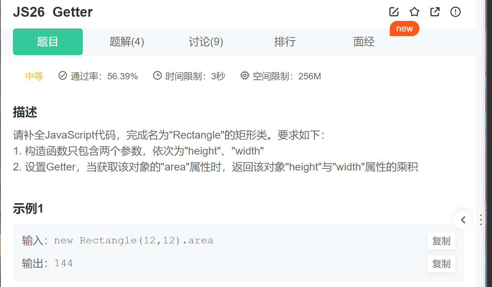

第一步.构造函数中需要两个参数分别为“width”和“height”

~~~js
constructor(height, width) {
        this.height = height
        this.width = width
    }
~~~

第二步.设置getter，按照题目一步一步来就可以

~~~js
get area() {
        return this.height * this.width
    }
~~~

