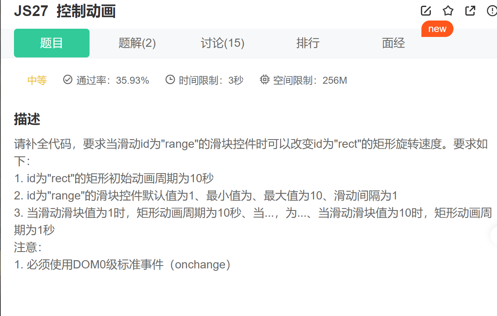

第一步.设置id为”rect“矩形的动画属性

~~~js

~~~

第二步.补全id为”range'“的滑动框, id为"range"的滑块控件默认值为1、最小值为、最大值为10、滑动间隔为1

~~~JS
<input id="range" type="range" step="1" defaultValue="1" value="1" min="1" max="10">
~~~

第三步.获取到id为”range“的滑动框并添加改变事件并且在改变事件中修改id为”rect“的矩形动画周期事件

 id为"rect"的矩形初始动画周期为10秒

当滑动滑块值为1时，矩形动画周期为10秒、当...，为...、当滑动滑块值为10时，矩形动画周期为1秒

~~~JS
document.querySelector('#range').onchange = function() {
     let speed = document.querySelector('#range').value
    
     document.querySelector('#rect').style.animationDuration = 11 - speed + 's'
}
~~~

