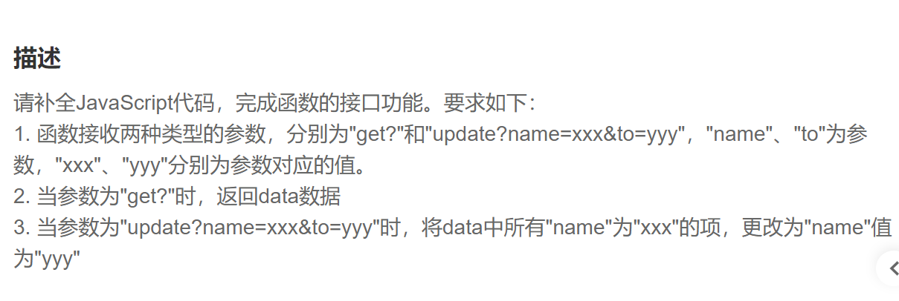

第一步.首先通过”?“拆解字符串参数，获取到方法

~~~js
let method = string.split('?')[0]
~~~

第二步.如果api请求为”get“，则返回data

~~~js
 switch(method) {
        case 'get': {
            return data
            break
        }
~~~

第三步.如果api请求为”update“，则需要继续拆解参数信息

拆解请求参数信息之后根据内容修改data数据

~~~js
case 'update': {
            let query = string.split('?')[1]
            let name = query.split('&')[0].split('=')[1]
            let to = query.split('&')[1].split('=')[1]
            for(item of data) {
                if(item.name === name) item.name = to
            }
            break
        }
~~~

第四步.默认返回空

~~~js
  default: {
            return ''
        }
    }
~~~

