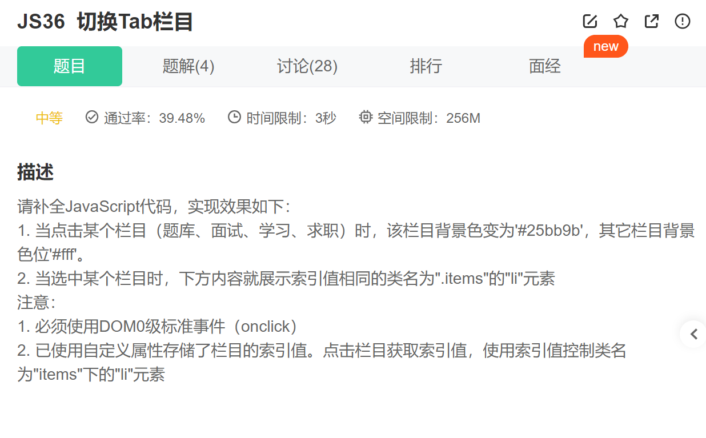

第一步：为ul添加点击事件

~~~js
// 1.为ul添加点击事件
    options.onclick = function(e) {}
~~~

第二步.循环遍历所有栏目

~~~js
  for( let i in optionItems) {}
~~~

第三步.

~~~js
  // e.target返回触发事件的元素
                    if(e.target === optionItems[i]) {
                        // 选中的栏目颜色变化
                        optionItems[i].style.backgroundColor = '#25bb9b';
                        // 内容变化
                        items[i].style.display = 'block';
                    } else {
                        // 其他栏目背景色
                        optionItems[i].style.backgroundColor = '#fff';
                        // 内容隐藏
                        items[i].style.display = 'none';
                    }
~~~

