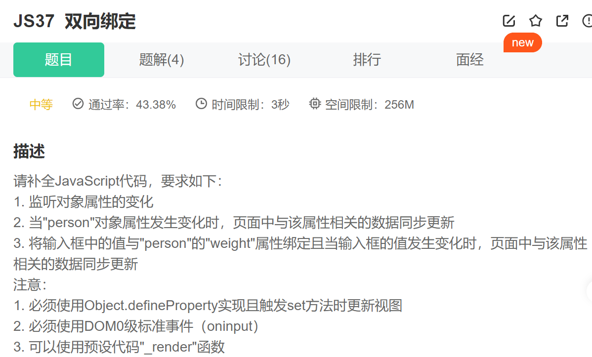

第一步.监听input输入框的输入内容变化事件

~~~js
 inp.oninput = function(e) {
                // 数据双向绑定
                person.weight = this.value;
            }
~~~

第二步.更新数据

~~~js
 Object.keys(person).forEach(key=>{
                // 获取person的属性值
                let value = person[key];
                // 更新视图
                Object.defineProperty(person, key,{
                    set(newVal) {
                        if(newVal !== value){
                            // 更新变化
                            value = newVal;
                            _render(ul);
                        }
                    },
                    get() {
                        return value;
                    }
                })
            })
~~~

