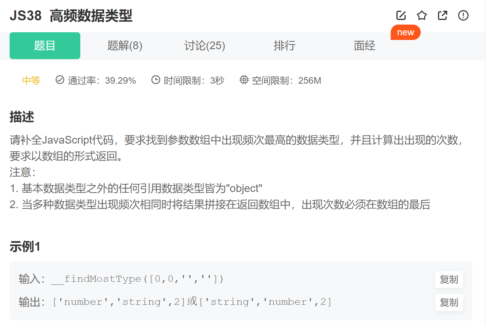

第一步：声明变量

1. 声明一个临时对象，用于存储数据类型和该数据类型出现的频次
2. 声明一个数组，用于返回结果
3. 声明一个数字，用于保存出现最高频的数据类型次数

~~~js
   let tem = {}
    let arr = []
    let num = 0
~~~

第二步.遍历数组中每一项

~~~js
    for (let i = 0; i < array.length; i++) {}
~~~

第三步.  判断每一项的数据类型

~~~js
       let type = typeof (array[i])
~~~

第四步.判断数据类型是否出现过 出现过值就加一 没出现过就为1, obj[type] 默认在obj对象中添加type属性 初始值为undifine

~~~js
     if (obj[type]) {
                    obj[type]++
                } else {
                    obj[type] = 1
                }
~~~

第五步.选出出现频率次数最高的值 给num,大于保留boj[type]的值 不大于保留原来的值

         ~~~JS
 num = obj[type] > num ? obj[type] : num
         ~~~

第六步.遍历，接受出现频率次数最多的数据类型

~~~js
 let arr = [] //接受出现频率次数最多的数据类型
            for (key in obj) {
                if (obj[key] === num) {
                    arr.push(key)
                }
            }
~~~

最后，返回

~~~js
  return [...arr, num]
~~~

