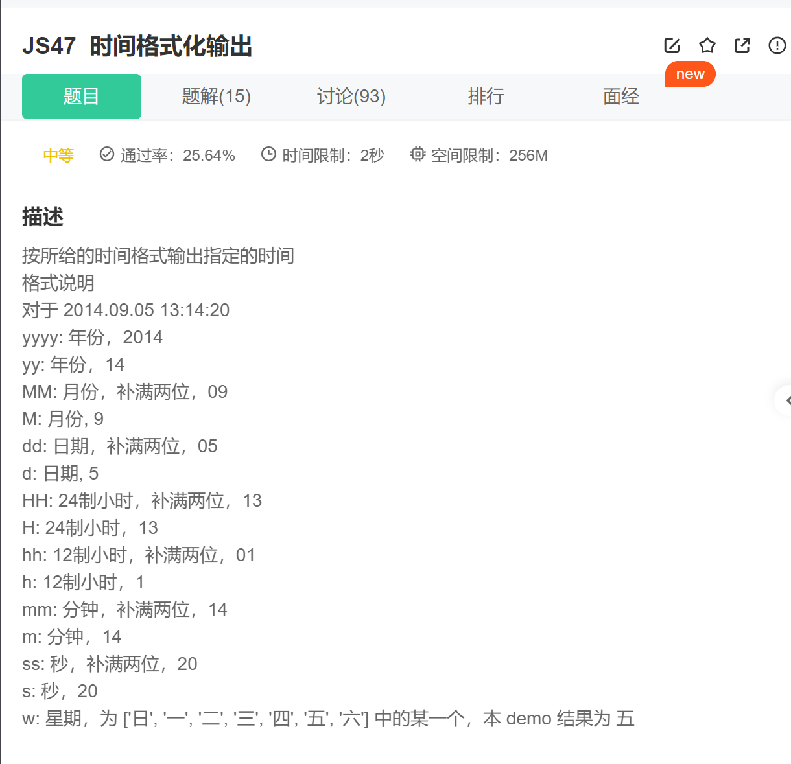

第一步.补0操作

~~~js
function pad(n){
    return n < 10 ? '0' + +n : n;
}

~~~

第二步.定义值，最后返回替换

~~~js
var year = d.getFullYear(),
        month = d.getMonth()+1,
        date = d.getDate(),
        hour = d.getHours(),
        minute = d.getMinutes(),
        second = d.getSeconds(),
        day = d.getDay(),
        week = ['日', '一', '二', '三', '四', '五', '六'];
~~~

~~~js
    return format.replace(/yyyy/, year)
                    .replace(/yy/, pad(year % 100))
                    .replace(/MM/, pad(month))
                    .replace(/M/, month)
                    .replace(/dd/, pad(date))
                    .replace(/d/, date)
                    .replace(/HH/, pad(hour))
                    .replace(/H/, hour)
                    .replace(/hh/, pad(hour % 12))
                    .replace(/h/, hour % 12)
                    .replace(/mm/, pad(minute))
                    .replace(/m/, minute)
                    .replace(/ss/, pad(second))
                    .replace(/s/, second)
                    .replace(/w/, week[day]);
}
~~~

