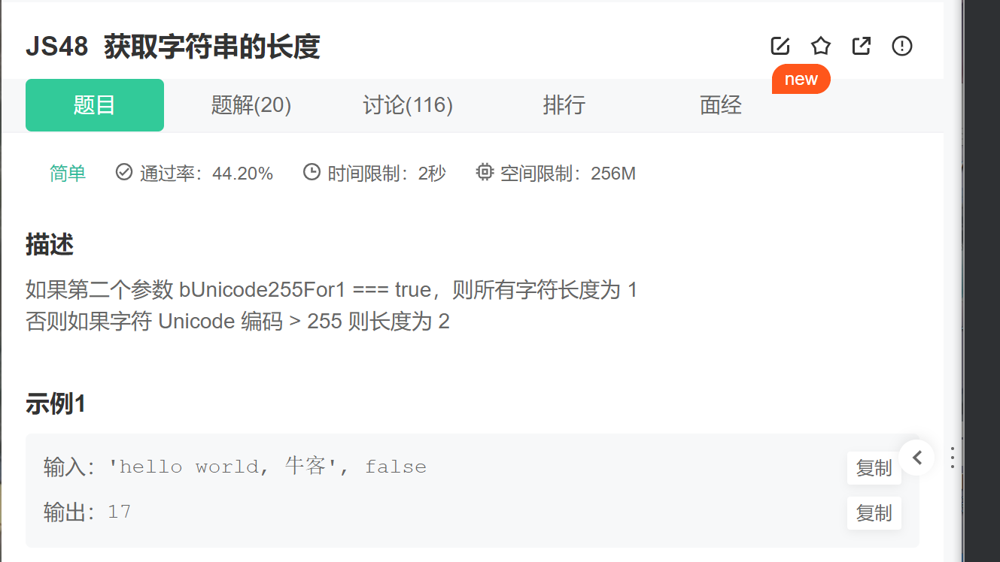

`1``、它的意思是如果传进来的参数（也就是bUnicode255For1）是传的``true``，`

`那么字符串中每个字符按照``1``的长度来计算`

~~~js
 if (bUnicode255For1) {
        return s.length;
    }
~~~

`2``、如果传进来的是flase，那么再对每一个字符进行判断，如果它们的unicode编码>``255``(a=``97``)，那么该字符就按照``2``的长度来计算。`

`3``、比较啰嗦，但是理解了就很简单了。（获取编码数：charCodeAt（index） ``//可以拿到指定位置的编码数）`

`4``、要注意一点：length和s.length  （length用于每次遍历判断的时候递增的数，s.length是方便于遍历，只能暂时表示有多少个字符，而不能代表总的字符长度是多少）`

~~~js
else {
        for (var i = 0, length = 0; i < s.length; i++) {
            if (s.charCodeAt(i) > 255) {
                length = length + 2;
            } else {
                length++;
            }
        }
        return length;
    }
}
~~~

