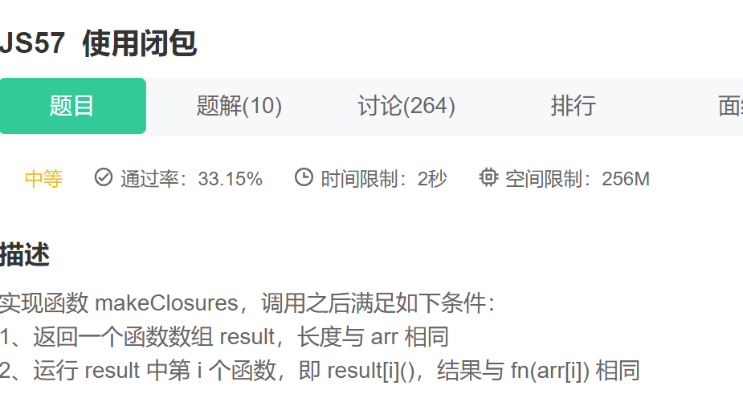

第一步：建立一个空数组

~~~js
   let result=[];
~~~

第二步：for循环遍历数组，返回一个函数数组result，长度与arr相同

~~~js
  for(let i=0;i<arr.length;i++){}
~~~

第三步：运用bind改变this指向，即result[i](),结果与fn（arr[i）相同。

~~~js
 result[i]=fn.bind(this,arr[i]);
~~~

