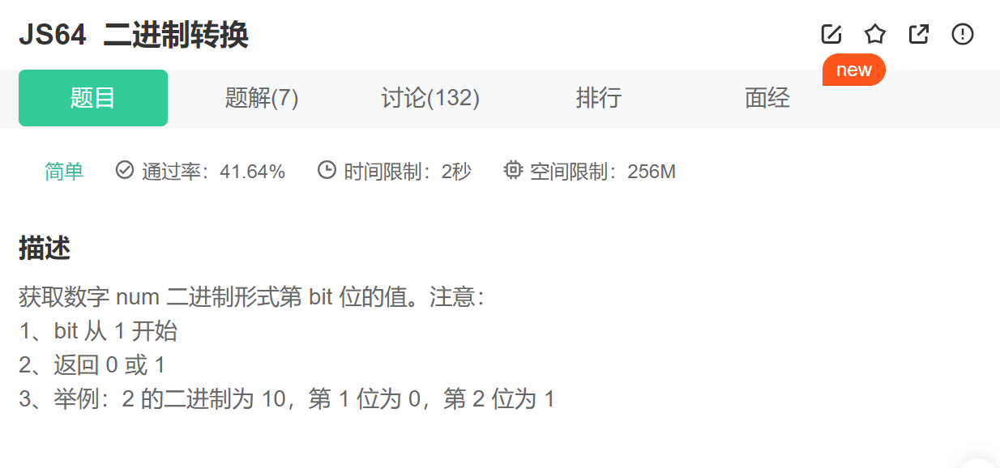

方法一：toString()
Number.toString([radix]):
返回指定 Number 对象的字符串表示形式；radix指定要用于数字到字符串的转换的基数(从2到36)。如果未指定 radix 参数，则默认值为 10

~~~js
function valueAtBit(num, bit) {
    let Num2Str = num.toString(2)
    return Num2Str[Num2Str.length - bit]
}
~~~

